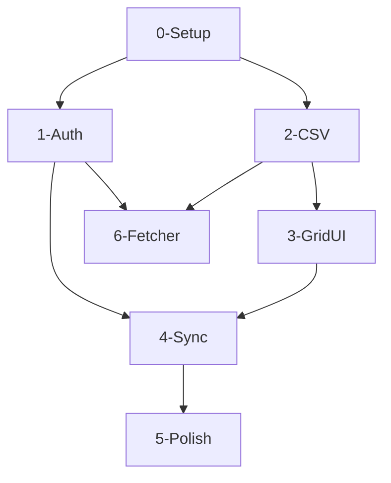

# Modules Master Plan: Jira Worklog CSV Uploader

## Global Tech Stack
- **Framework**: Vite **6.x** + React **19.x** + TypeScript **5.x**
- **Styling**: Tailwind CSS **4.x**
- **Icons**: Lucide React **0.x**
- **CSV Engine**: PapaParse **5.x**
- **Date Utilities**: Date-fns **4.x**

## Global Design Rules
- **Philosophy**: Solid & Simple. One workspace (The Grid), no complex mode switching.
- **Core Palette**: 
    - Primary: Atlassian Blue (#0052CC)
    - Surface: Slate-50 (Light) / Slate-950 (Dark)
- **Typography**: Inter.

## Global Data Model

| Entity | Key Fields | Relationships | Storage Hint |
|--------|-----------|---------------|-------------|
| AuthConfig | domain, authType, credentials | - | LocalStorage |
| WorklogEntry | id, issueKey, date, timeSpent, comment, status | - | React State |

## Module List & Dependencies

### Module 0: Scaffolding (Setup)
- **Goal**: Initialize Vite, Tailwind, and project folder structure.

### Module 1: Auth Bridge
- **Goal**: Implement OAuth 2.0 (3LO) and API Token handlers.
- **Depends on**: M0

### Module 2: CSV Data Engine
- **Goal**: Implement PapaParse streaming and auto-mapping logic.
- **Depends on**: M0

### Module 3: Unified Spreadsheet Grid
- **Goal**: Create the interactive grid with **Inline 8h/day Capacity Calculation**.
- **Depends on**: M2

### Module 4: Sync Controller
- **Goal**: Implement Batch and Single-Row API processing.
- **Depends on**: M1, M3

### Module 5: Polish & Reports
- **Goal**: Final UI touches, success summaries, and error logs.
- **Depends on**: M4

### Module 6: Jira Event Fetcher
- **Goal**: Auto-log work by scanning status changes in Jira.
- **Depends on**: M1, M2

## Dependency Graph

## Risk Chains
- **Grid -> Sync**: Invalid formats in the grid must block the sync button.
- **Auth -> Sync**: Token expiration must trigger a graceful pause.
